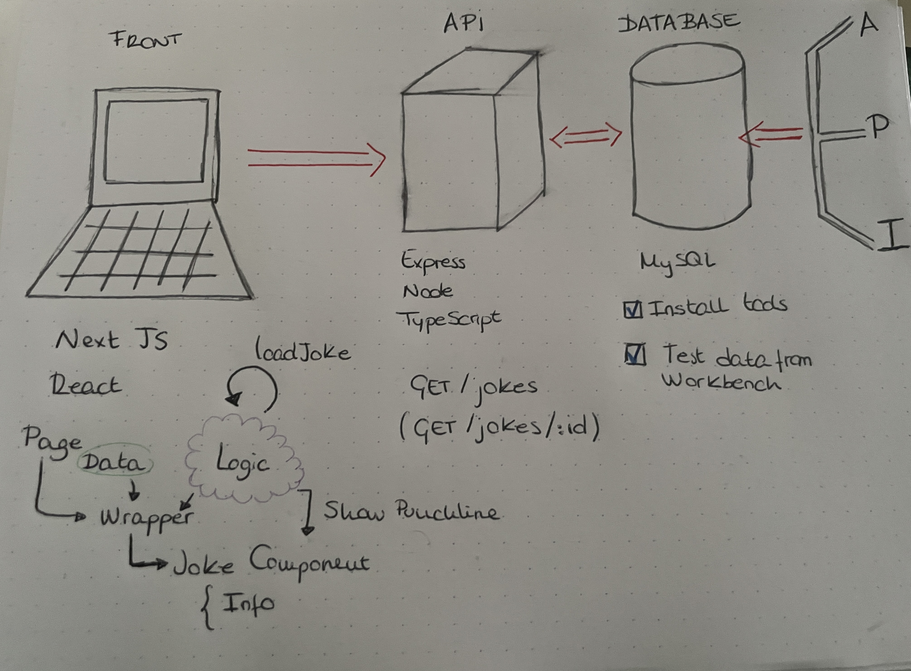

# Full Stack Developer Task

Installation requirements:

- MySQL Server
- MySQL Workbench
- MySQL Shell
- Node

## Guidelines


I created everything in a single app because NextJs allows us having UI app and a simple API inside as a middleware. For this reaseon, I decided using the nextjs custom server insteaf of using Express in another app.

This strategy give us the possibility of doing the whole stack in a same repository.

## Start the project

- Download data file from path: https://raw.githubusercontent.com/15Dkatz/official_joke_api/master/jokes/index.json
- Create database schema named “full-stack-developer-task”.
- Execute the provided database scripts(\*)
- Import the data in the jokes table from the downloaded JSON file (\*\*).
- Start database.
- Clone git repository: https://github.com/albaMCh/full-stack-developer-task.git
- Open project in some IDE.
- Run the npm install command
- Set environment variables in a .env.local file from the .env.template
- Start the application with npm run dev.

```
\*CREATE SCHEMA `full-stack-developer-task` ;
 CREATE TABLE `full-stack-developer-task`.`jokes` (
  `id` INT NOT NULL,
  `type` VARCHAR(45) NOT NULL,
  `setup` VARCHAR(200) NOT NULL,
  `punchline` VARCHAR(200) NOT NULL,
  PRIMARY KEY (`id`));
```

\*\*Import file in the `full-stack-developer-task`.`jokes` table using the workbench wizard:

- Table Data Import Wizard
- Browse and choose json file and Next
- Use existing table `full-stack-developer-task`.`jokes`
- Truncate table before import and Next
- Confirm column mappings and next
- Next several times and finish
